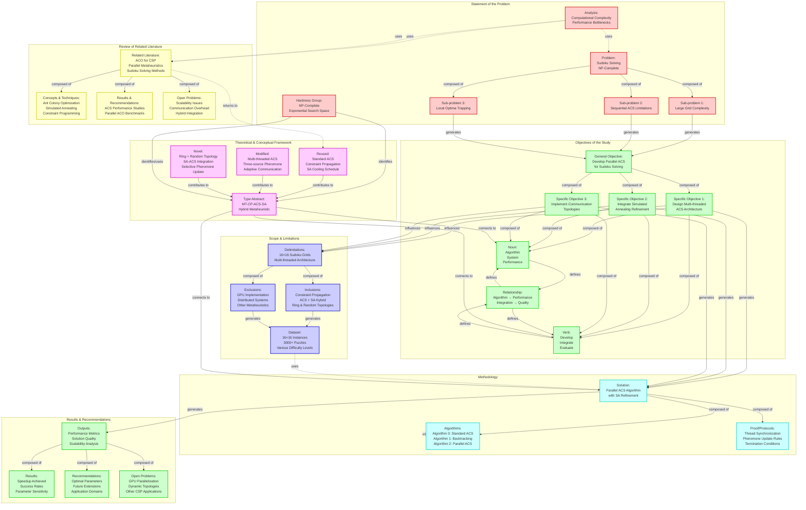
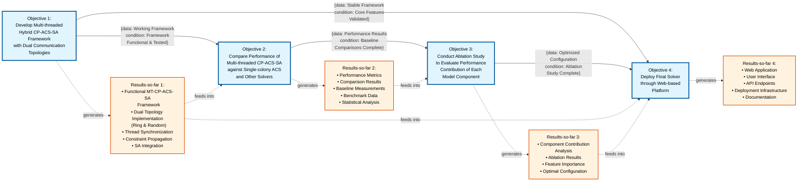

# Figure 5: Components and their Relationships in a Research Manuscript

## Overview

This diagram illustrates the interconnected components and their relationships in the research manuscript on **Parallel Ant Colony System with Simulated Annealing for Sudoku Puzzle Solving**.

---

## Visual Diagram (Mermaid)

---

## Text-Based Component Relationships

### 1. Statement of the Problem

**Main Problem:**
- **Problem**: Solving large-scale Sudoku puzzles (16×16) efficiently using metaheuristic approaches
- **Complexity**: NP-Complete problem with exponential search space

**Sub-problems:**
- **Sub-problem 1**: Computational complexity of large grid sizes (16×16, 25×25)
- **Sub-problem 2**: Limitations of sequential Ant Colony System (ACS) in terms of convergence speed
- **Sub-problem 3**: Local optima trapping in metaheuristic search

**Hardness Classification:**
- **Hardness (group)**: NP-Complete constraint satisfaction problem
- **Search Space**: Exponential growth with grid size (16^256 for 16×16 grids)

**Analysis:**
- **Analysis** → uses → **Problem**: Computational complexity analysis
- **Analysis** → uses → **Related Literature**: Performance bottleneck identification

**Flow:**
- **Sub-problem** → generates → **General Objective**

---

### 2. Objectives of the Study

**General Objective:**
- Develop a Parallel Ant Colony System with Simulated Annealing for efficient Sudoku puzzle solving

**Specific Objectives:**
- **Specific Objective 1**: Design and implement a multi-threaded ACS architecture with independent sub-colonies
- **Specific Objective 2**: Integrate Simulated Annealing for local solution refinement
- **Specific Objective 3**: Implement adaptive communication topologies (ring and random) for inter-thread information exchange

**Component Structure:**
- **Specific Objective** → composed of → **Noun** (Algorithm, System, Performance)
- **Specific Objective** → composed of → **Verb** (Develop, Integrate, Evaluate)
- **Noun** ↔ **Verb** ↔ **Relationship** (bidirectional definition)

**Flow:**
- **Specific Objective** → generates → **Solution**

---

### 3. Scope & Limitations

**Delimitations:**
- **Delimitations**: Focus on 16×16 Sudoku grids, multi-threaded CPU implementation, ACS-based approach

**Composition:**
- **Delimitations** → composed of → **Inclusions**: Constraint propagation, ACS+SA hybrid, ring & random topologies
- **Delimitations** → composed of → **Exclusions**: GPU implementation, distributed systems, other metaheuristics (GA, PSO)

**Dataset Generation:**
- **Inclusions** + **Exclusions** → generates → **Dataset**
- **Dataset**: 16×16 instances, 3000+ puzzles, various difficulty levels

**Flow:**
- **Dataset** → uses → **Solution**

---

### 4. Review of Related Literature

**Related Literature:**
- Ant Colony Optimization for Constraint Satisfaction Problems
- Parallel Metaheuristics and their classification
- Existing Sudoku solving methods (exact and metaheuristic)

**Composition:**
- **Related Literature** → composed of → **Concepts & Techniques**: ACO, SA, Constraint Programming
- **Related Literature** → composed of → **Results & Recommendations**: ACS performance studies, parallel ACO benchmarks
- **Related Literature** → composed of → **Open Problems**: Scalability issues, communication overhead, hybrid integration

**Relationships:**
- **Analysis** → uses → **Related Literature**
- **Related Literature** → returns to → **Reused** (in Theoretical Framework)

---

### 5. Theoretical & Conceptual Framework

**Type Abstract:**
- **Type <abstract>**: MT-CP-ACS-SA (Multithreaded Constraint Programming-Ant Colony System-Simulated Annealing)

**Component Sources:**
- **Reused**: Standard ACS algorithm, constraint propagation techniques, SA cooling schedules
- **Modified**: Multi-threaded ACS architecture, three-source pheromone update mechanism, adaptive communication intervals
- **Novel**: Combined ring + random topology, SA-ACS integration strategy, selective pheromone update protocol

**Connections:**
- **Type <abstract>** ↔ **Noun** (defines algorithm components)
- **Type <abstract>** ↔ **Verb** (defines operations)
- **Type <abstract>** → connects to → **Solution**

**Identification:**
- **Hardness (group)** → identifies/uses → **Type <abstract>**

---

### 6. Methodology

**Solution:**
- **Solution**: Parallel ACS Algorithm with Simulated Annealing Refinement

**Composition:**
- **Solution** → composed of → **Algorithms**:
  - Algorithm 0: Standard Ant Colony System
  - Algorithm 1: Backtracking Search
  - Algorithm 2: Parallel ACS with Communication
- **Solution** → composed of → **Proof/Protocols**:
  - Thread synchronization mechanisms
  - Pheromone update mathematical formulations
  - Termination conditions and convergence criteria

**Self-reference:**
- **Algorithms** → uses → **Methodology** (methodology defines how algorithms are applied)

---

### 7. Results & Recommendations

**Outputs:**
- **Outputs**: Performance metrics, solution quality measures, scalability analysis

**Composition:**
- **Outputs** → composed of → **Results & Recommendations**:
  - Speedup achieved through parallelization
  - Success rates across different puzzle difficulties
  - Parameter sensitivity analysis
- **Outputs** → composed of → **Open Problems (offshoot)**:
  - GPU parallelization opportunities
  - Dynamic topology adaptation
  - Application to other CSP domains

**Flow:**
- **Solution** → generates → **Outputs**

---

## Relationship Types

### Solid Lines (Composition/Structure)
- **Problem** → composed of → **Sub-problem**
- **General Objective** → composed of → **Specific Objective**
- **Delimitations** → composed of → **Inclusions/Exclusions**
- **Related Literature** → composed of → **Concepts/Results/Open Problems**
- **Solution** → composed of → **Algorithms/Proof**
- **Outputs** → composed of → **Results/Recommendations/Open Problems**

### Dashed Arrows (Generation/Usage)
- **Sub-problem** → generates → **General Objective**
- **Specific Objective** → generates → **Solution**
- **Inclusions/Exclusions** → generates → **Dataset**
- **Dataset** → uses → **Solution**
- **Solution** → generates → **Outputs**
- **Analysis** → uses → **Problem** and **Related Literature**
- **Hardness (group)** → identifies/uses → **Type <abstract>**
- **Related Literature** → returns to → **Reused**

### Influence Arrows
- **Specific Objective** → influences → **Delimitations**

### Bidirectional Relationships
- **Noun** ↔ **Verb** ↔ **Relationship** (mutual definition)
- **Type <abstract>** ↔ **Noun/Verb** (defines and is defined by)

---

## Key Research Flow

1. **Problem Identification** → Analysis of Sudoku solving complexity and sequential ACS limitations
2. **Objective Setting** → Development of parallel ACS with SA integration objectives
3. **Scope Definition** → Delimitation to 16×16 grids and multi-threaded architecture
4. **Literature Review** → Survey of ACO, parallel metaheuristics, and Sudoku solving methods
5. **Framework Development** → Integration of reused, modified, and novel components into MT-CP-ACS-SA
6. **Methodology Design** → Specification of algorithms, protocols, and implementation details
7. **Solution Implementation** → Parallel ACS with communication topologies and SA refinement
8. **Evaluation & Output** → Performance analysis, results, and recommendations for future work

---

## Notes

- This diagram follows the structure of Figure 5 from the reference, adapted to the specific research on Parallel Ant Colony System for Sudoku solving
- All components are derived from the actual research documentation and implementation
- Relationships reflect the logical flow from problem identification through solution development to results
- The diagram can be used in the thesis manuscript to illustrate the research structure and component relationships

---

# Figure 2: Map of Precedences of Objectives and Results-so-far

## Overview

This diagram illustrates the precedence relationships between the study objectives and the data/conditions required for transitioning from one objective to the next in the research on **Multi-threaded Hybrid CP-ACS-SA Framework for Sudoku Solving**.

---

## Visual Diagram (Mermaid)

---

## Text-Based Precedence Map

### Objective 1: Develop Multi-threaded Hybrid CP-ACS-SA Framework
**Description:** Develop a multi-threaded hybrid CP-ACS-SA framework for Sudoku solving integrated with dual communication topologies (unidirectional ring and random).

**Prerequisites:** None (Initial Objective)

**Results-so-far 1:**
- Functional MT-CP-ACS-SA Framework
- Dual Topology Implementation (Ring & Random)
- Thread Synchronization Mechanisms
- Constraint Propagation Integration
- Simulated Annealing Integration
- Core Algorithm Implementation

**Transition Conditions:**
- Framework is functional and tested
- Core features are validated
- Basic performance validation completed

---

### Objective 2: Compare Performance
**Description:** Compare the performance of the proposed multi-threaded CP-ACS-SA against a single-colony ACS solver and other well-known Sudoku solvers.

**Prerequisites:** 
- **From Objective 1:** Working Framework (data: functional MT-CP-ACS-SA system, condition: framework is functional and tested)

**Results-so-far 2:**
- Performance Metrics (execution time, success rate, convergence speed)
- Comparison Results (vs. single-colony ACS, vs. other solvers)
- Baseline Measurements
- Benchmark Dataset Results
- Statistical Analysis (significance tests, confidence intervals)

**Transition Conditions:**
- Baseline comparisons completed
- Performance data collected and analyzed
- Statistical significance established

---

### Objective 3: Conduct Ablation Study
**Description:** Conduct an ablation study to evaluate the performance contribution of each model component.

**Prerequisites:**
- **From Objective 2:** Performance Results (data: comparison results and baseline measurements, condition: baseline comparisons complete)

**Results-so-far 3:**
- Component Contribution Analysis
- Ablation Study Results (individual component impact)
- Feature Importance Rankings
- Optimal Configuration Identification
- Component Interaction Analysis

**Transition Conditions:**
- Ablation study complete
- Component contributions quantified
- Optimal configuration identified

---

### Objective 4: Deploy Web-based Platform
**Description:** Deploy the final solver through a web-based platform.

**Prerequisites:**
- **From Objective 1:** Stable Framework (data: core framework implementation, condition: core features validated)
- **From Objective 3:** Optimized Configuration (data: ablation results and optimal configuration, condition: ablation study complete)

**Results-so-far 4:**
- Web Application (frontend and backend)
- User Interface (puzzle input, visualization, results display)
- API Endpoints (solver service, result retrieval)
- Deployment Infrastructure (hosting, scalability)
- User Documentation and Tutorials

**Transition Conditions:**
- Web platform is functional
- Deployment is successful
- User testing completed

---

## Precedence Relationships Summary

### Direct Precedences (Sequential Flow)
1. **Objective 1 → Objective 2**
   - **Data:** Working Framework (functional MT-CP-ACS-SA system)
   - **Condition:** Framework is functional and tested

2. **Objective 2 → Objective 3**
   - **Data:** Performance Results (comparison results, baseline measurements)
   - **Condition:** Baseline comparisons complete

3. **Objective 3 → Objective 4**
   - **Data:** Optimized Configuration (ablation results, optimal component configuration)
   - **Condition:** Ablation study complete

### Parallel/Alternative Precedences
4. **Objective 1 → Objective 4** (Alternative path)
   - **Data:** Stable Framework (core framework implementation)
   - **Condition:** Core features validated
   - **Note:** This allows early deployment of a basic version, with optimization from Objective 3 integrated later

### Results Feedback Loop
- **Results-so-far 1** feeds into Objectives 2 and 4
- **Results-so-far 2** feeds into Objective 3
- **Results-so-far 3** feeds into Objective 4 (optimization)
- **Results-so-far 4** represents the final deliverable

---

## Key Dependencies

### Critical Path
**Objective 1 → Objective 2 → Objective 3 → Objective 4**

This represents the primary research progression where each objective builds upon the previous one's results.

### Parallel Development Opportunity
**Objective 1 → Objective 4** (early deployment path)

This allows for early web platform development using the initial framework, which can later be optimized based on ablation study results.

---

## Notes

- The precedence map follows the structure of Figure 2, showing sequential relationships between objectives
- Each transition is labeled with the required data and conditions
- Results-so-far are shown as outputs that feed into subsequent objectives
- The diagram illustrates both the critical path and alternative development paths
- This map can be used to track research progress and identify dependencies between objectives

