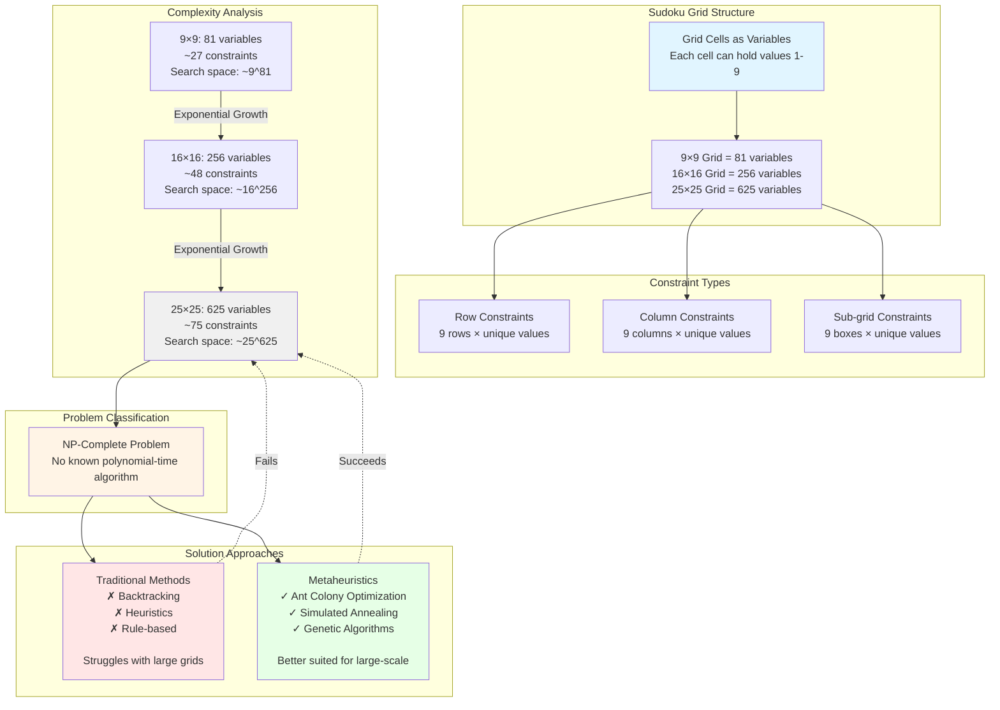

# Sudoku as a Constraint Satisfaction Problem

## Overview Diagram



## Text-Based Visual Representation

```
┌─────────────────────────────────────────────────────────────────────────────┐
│                    SUDOKU CONSTRAINT SATISFACTION PROBLEM                   │
└─────────────────────────────────────────────────────────────────────────────┘

┌──────────────────────────────┐         ┌──────────────────────────────┐
│         VARIABLES            │         │        CONSTRAINTS           │
│    (Grid Cells)              │────────▶│        (Rules)               │
│                              │         │                              │
│  • Each cell is a variable   │         │  Row Constraints:            │
│  • Domain: {1, 2, ..., 9}    │         │  • 9 rows                    │
│  • Must satisfy all rules    │         │  • Each row: 1-9 unique      │
│                              │         │                              │
│  Grid Sizes:                 │         │  Column Constraints:         │
│  • 9×9   =  81 variables     │         │  • 9 columns                 │
│  • 16×16 = 256 variables     │         │  • Each column: 1-9 unique   │
│  • 25×25 = 625 variables     │         │                              │
│                              │         │  Sub-grid Constraints:       │
│                              │         │  • 9 boxes (3×3 each)        │
│                              │         │  • Each box: 1-9 unique      │
└──────────────────────────────┘         └──────────────────────────────┘
                    │                              │
                    └──────────────┬───────────────┘
                                   │
                    ┌──────────────▼──────────────┐
                    │   CONSTRAINT SATISFACTION   │
                    │                             │
                    │  All variables must satisfy │
                    │  all related constraints    │
                    └──────────────┬──────────────┘
                                   │
                    ┌──────────────▼──────────────┐
                    │     PROBLEM COMPLEXITY      │
                    │                             │
                    │     ╱│╲                     │
                    │    │ │ │                    │
                    │    └─┴─┘                    │
                    │  NP-COMPLETE                │
                    │                             │
                    │  No polynomial-time         │
                    │  solution exists            │
                    └──────────────┬──────────────┘
                                   │
        ┌──────────────────────────┴──────────────────────────┐
        │                                                      │
┌───────▼────────┐                                  ┌─────────▼─────────┐
│  TRADITIONAL   │                                  │  METAHEURISTICS   │
│   METHODS      │                                  │   (Recommended)   │
├────────────────┤                                  ├───────────────────┤
│  • Backtracking│                                  │  • Ant Colony     │
│  • Heuristics  │                                  │    Optimization  │
│  • Rule-based  │                                  │  • Simulated      │
│                │                                  │    Annealing      │
│  ❌ Performance│                                  │  • Genetic        │
│     degrades   │                                  │    Algorithms     │
│     exponentially│                                │                   │
│                │                                  │  ✅ Better scaling│
│  ❌ Struggles  │                                  │  ✅ Handles large │
│     with large │                                  │     search spaces │
│     grids      │                                  │  ✅ Can escape    │
│                │                                  │     local optima  │
└────────────────┘                                  └───────────────────┘
```

## Complexity Growth Table

| Grid Size | Variables | Constraints (approx) | Search Space Complexity | Traditional Methods | Metaheuristics |
|-----------|-----------|---------------------|------------------------|---------------------|----------------|
| **9×9**   | 81        | ~27                 | ~9^81 possibilities     | ⚠️ Works            | ✅ Excellent   |
| **16×16** | 256       | ~48                 | ~16^256 possibilities   | ❌ Struggles        | ✅ Good        |
| **25×25** | 625       | ~75                 | ~25^625 possibilities   | ❌ Fails            | ✅ Suitable    |

### Key Observations:

1. **Exponential Growth**: As grid size increases linearly (9 → 16 → 25), the number of variables grows quadratically (81 → 256 → 625).

2. **Search Space Explosion**: The search space grows exponentially with grid size, making exhaustive search impossible for large grids.

3. **NP-Completeness**: Sudoku has been proven to be NP-complete, meaning:
   - There is no known polynomial-time algorithm to solve it
   - Verifying a solution is easy (polynomial time)
   - Finding a solution is hard (exponential time in worst case)

4. **Why Metaheuristics Work Better**:
   - They don't require exploring the entire search space
   - Use intelligent search strategies (pheromones in ACO, temperature in SA)
   - Can escape local optima
   - Scale better with problem size
   - Balance exploration and exploitation

## Conceptual Flow Diagram

```
                    SUDOKU PUZZLE
                         │
                         │
        ┌────────────────┴────────────────┐
        │                                 │
   VARIABLES                        CONSTRAINTS
   (Cells)                          (Rules)
        │                                 │
        │  • Row uniqueness               │
        │  • Column uniqueness            │
        │  • Sub-grid uniqueness          │
        │                                 │
        └────────────────┬────────────────┘
                         │
                    CSP INSTANCE
                         │
                         │
            ┌────────────┴────────────┐
            │                         │
      GRID SIZE                  COMPLEXITY
      Increases                   Increases
            │                         │
            │  9×9 → 16×16 → 25×25   │
            │  81 → 256 → 625 vars   │
            │                         │
            └────────────┬────────────┘
                         │
                    NP-COMPLETE
                         │
            ┌────────────┴────────────┐
            │                         │
   TRADITIONAL                  METAHEURISTICS
   METHODS                      (ACO + SA)
            │                         │
            │                         │
      ❌ Backtracking            ✅ Global search
      ❌ Heuristics              ✅ Local refinement
      ❌ Rule-based              ✅ Scales well
      │                         │
      └───── Struggles with ────┘
            large grids
```

## Summary

Sudoku is a constraint satisfaction problem where:
- **Variables** = Grid cells (81, 256, 625 depending on grid size)
- **Constraints** = Row, column, and sub-grid uniqueness rules
- **Complexity** = Grows exponentially with grid size
- **Problem Class** = NP-complete (no polynomial-time solution)
- **Solution Approach** = Metaheuristics (ACO, SA) are better suited than traditional methods for large-scale Sudoku puzzles


